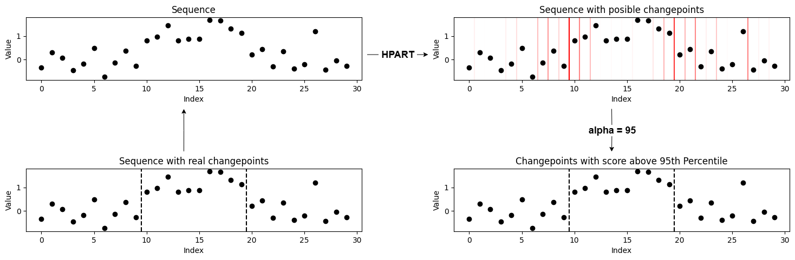

# ChangePoint Detection via Weighted Mean Difference

This repository implements an heuristic unsupervised changepoint detection method based on comparing weighted means of two segments around potential changepoints in a sequence.

## Overview

Given a univariate sequence `X` of length `N`, this method considers every point between two consecutive data points as a potential changepoint.

For each candidate changepoint `c`, the sequence is split into two segments:

- **Left segment:** `X[0:c]`
- **Right segment:** `X[c:N]`

The method computes a *difference score* `d(c)` between these segments defined as:

`d(c) = |m(left segment) - m(right segment)|`

For the **right segment**, the weighted mean is:

$$w_\alpha[i] = \frac{e^{-\alpha i}}{\sum_{k=c}^N e^{-\alpha k}}$$

$$m(\text{right segment}) = \sum_{i=c}^{N} w_\alpha[i] \cdot X[i]$$

By default, `α=0.5`. For the **left segment**, the segment time steps are reversed and the same weighted mean formula is applied.

This weighting scheme emphasizes points closer to the candidate changepoint more strongly.

### Changepoint Selection

The algorithm iterates over all possible changepoints, calculates the difference score `d(c)`, and produces a list of scores corresponding to each `c`.

Two options are supported for selecting changepoints based on the difference scores:

1. **Top-k Changepoints:** Select the top `k` candidate points with the highest difference scores.

2. **Quartile-based Thresholding:** Select candidate points with difference scores exceeding a specified percentile (e.g., the 75th percentile) to identify significant changepoints.

## Visualization Examples

